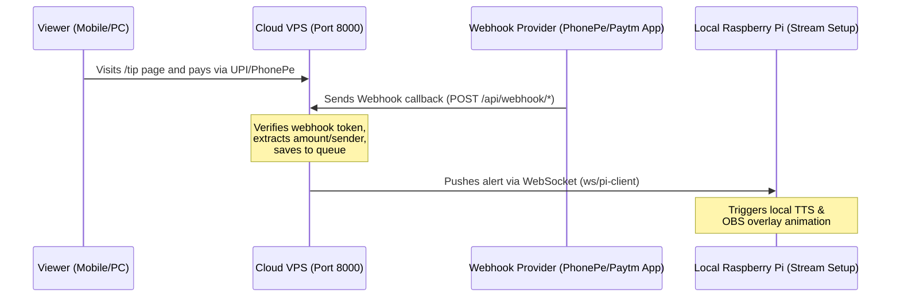

# Cloud Deployment & Hybrid Architecture Guide

This manual explains how to deploy the Pi Bot in a **Hybrid Cloud + Local Setup**. In this configuration:
1. **Cloud Server (VPS)**: Runs in **Cloud Mode** to host the public Tip Page, handle payment gateway interactions (PhonePe API), and receive payment alert webhooks (Android notification forwarders for Paytm/GPay/UPI).
2. **Local Client (Raspberry Pi)**: Runs in **Local Mode** inside your local streaming setup to handle audio output (TTS), display OBS overlay graphics, and manage Streamer.bot integration.

---

## Architecture Overview



- **Cloud Mode (`RUN_MODE=cloud`)**: Directs the server to act as a hub. It enables the `/ws/pi-client` socket server and routes all payment webhooks to queue alerts.
- **Local Mode (Default)**: Connects to the cloud hub via WebSocket using `CloudAlertClientService` to fetch and play pending alerts in real time.

---

## 🔒 Security & Administrative Access

To protect your configuration, credentials, and databases, the system implements two security systems:

### 1. HTTP Basic Authentication (Admin Routes)
When `security.dashboard_password` (or environment variable `DASHBOARD_PASSWORD`) is set, any request to administrative dashboard paths or APIs is protected:
- **Username**: `admin`
- **Password**: (Auto-generated or custom configured in `config.json`)
- **Exempt Paths**: Public paths such as `/tip`, `/assets`, `/api/donate`, and `/api/webhook/*` are never blocked, allowing viewers to access the tip page and pay without credential prompts.

### 2. Tunnel Security Middleware
If the server detects requests arriving through a public Cloudflare Tunnel or proxy domain, it automatically blocks all non-whitelisted paths (with a **403 Forbidden** error) unless the administrator logs in via the Basic Auth system.

---

## 🚀 Step 1: Cloud Server (VPS) Deployment

Run the automated cloud installer script on your VPS:

```bash
curl -sSL https://raw.githubusercontent.com/PBtoolsfree/pibot/main/scripts/deploy_cloud.sh | bash
```

### What the Installer Does Automatically:
1. Checks for compatibility and updates system repositories.
2. Installs system packages: `git`, `python3`, `python3-venv`, `nodejs v20 (LTS)`, `npm`, `sqlite3`.
3. Creates a Python virtual environment and installs requirements.
4. Initializes `config.json` and generates secure unique tokens:
   - **`security.dashboard_password`**: Your admin login password.
   - **`security.webhook_secret`**: Token used to authenticate webhooks and Pi client websocket connections.
5. Builds the React frontend.
6. Installs and starts a systemd service (`pibot-cloud.service`) configured with `RUN_MODE=cloud`.

### Post-Install Output Example:
```text
============================================================
 🎉 CLOUD DEPLOYMENT COMPLETED SUCCESSFULLY!
============================================================
  URL:                http://<vps-ip>:8000
  Tip Page:           http://<vps-ip>:8000/tip
============================================================
  🔐 ADMIN CREDENTIALS:
    Username:         admin
    Password:         aBC_123_xyz
============================================================
  🔗 WEBSOCKET & WEBHOOK CONFIGURATION:
    Local Pi WS URL:  ws://<vps-ip>:8000/ws/pi-client?token=9ab7c8d...
    Webhook Secret:   9ab7c8d...
============================================================
```

---

## 🔌 Step 2: Webhook Configurations (Payment Providers)

Once the Cloud Server is running, configure your payment callbacks to route alerts to it.

### Method A: PhonePe API Webhook
1. Log in to your PhonePe Business portal.
2. Set the Webhook URL to:
   ```text
   http://<vps-ip>:8000/api/webhook/phonepe?secret=YOUR_WEBHOOK_SECRET
   ```

### Method B: Paytm / GPay Notification Forwarder
Use an Android notification forwarding app (e.g., **Notification 2 Webhook** from Google Play) on the phone receiving payment notifications.
1. Add a rule to capture notifications containing payment keywords (e.g., Paytm Business, PhonePe).
2. Set the webhook POST URL to:
   ```text
   http://<vps-ip>:8000/api/webhook/paytm?secret=YOUR_WEBHOOK_SECRET
   ```
3. Set the payload parameters to match the app's default format (capturing the notification text).

---

## 🍓 Step 3: Local Raspberry Pi Configuration

Configure your local Raspberry Pi to connect to the cloud server and receive alerts.

### 1. Update Configuration
Edit `config.json` on the Raspberry Pi:
```json
{
  "cloud_alert_url": "ws://<vps-ip>:8000/ws/pi-client",
  "security": {
    "webhook_secret": "YOUR_WEBHOOK_SECRET"
  }
}
```
*(Ensure `YOUR_WEBHOOK_SECRET` matches the secret generated on the cloud server).*

### 2. Restart the Pi Bot Service
Restart the service to apply changes and initiate the connection:
```bash
sudo systemctl restart pibot.service
```

### 3. Verify Connection
Monitor the Pi logs to confirm the connection is established:
```bash
sudo journalctl -fu pibot.service
```
You should see:
```text
[SYSTEM] Connected to Cloud Alert server
Successfully connected to Cloud Alert WebSocket!
```

Now, whenever a payment is received on the Cloud Server, it will be pushed in real-time to the Raspberry Pi to play the alert. If the Pi goes offline, the VPS queues the alerts and pushes them sequentially the moment the Pi reconnects.
